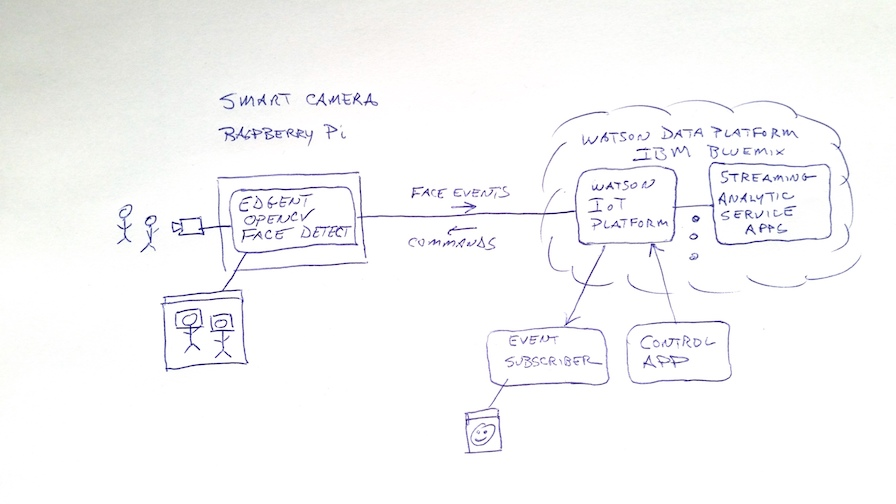

# streamsx.edgevideoanalytics.starterkit

An end-to-end video analytic demonstration performing video analytics on edge devices and centralized system.

Performing Video analytics at the Edge (in smarter IoT devices or gateways)
has many applications.
The kit can be used to jump-start the development of application
specific systems.

The kit is a work in progress.  See Status below.

The Smart Camera IoT Device portion of the kit was part of the 
ApacheCon/ApacheIoT 2017 talk:
"Video Analytics at the Edge: Fun with Apache Edgent, OpenCv, and a Raspberry Pi".
[Slides](http://events.linuxfoundation.org/sites/events/files/slides/EdgentOpenCVRevised-3bak.pdf)
[Audio](https://feathercast.apache.org/2017/05/30/apachecon-miami-2017-video-analytics-at-the-edge-fun-with-apache-edgent-opencv-and-a-raspberry-pi-william-marshall-dale-labossiere/)

## Video Analytics at the Edge
  
In short the idea is to evolve from a system like that in the upper image
in this [system evolution sketch](readmeImg/sketch1.jpg),
one with raw video feeds into an on-premise video analytic system that does
general face detection and then specific face recognition,
to a system like the lower image, with a smart IoT device that does 
the face detection, with cloud based streaming analytic applications doing
additional analytics such as the face recognition.  

<b>The IoT hub can either be a general MQTT broker such as Apache ActiveMQ
or it can be IBM Watson IoT Platform (or to Apache Kafka with a small
change to the app; and new Kafka*ClientApp simple client apps).
The following sketch is for the WIoTP mode configuration</b> .
    
Here's a [demo screenshot](readmeImg/faceDetect-demo-screenshot.png).  TBD watch this video.

The kit consists of an end-to-end demonstration system comprised of a 
controllable Smart Camera IoT device that performs general face detection,
publishing face detection events to the cloud, and a cloud based 
Streaming Analytic application that subscribes to these events and
performs specific face recognition processing on them.

The kit also includes simple client applications that connect to the
IoT hub to "send" commands to the device and to subscribe to detection
events and render the detected object's image.

The system promotes creation of a "smarter analytic edge device" to:
  - dramatically reduce communication bandwidth/costs by only
    sending "interesting" information
    - nothing is sent unless a face is detected
    - only the detected object's image region is sent, not a whole camera frame
  - enable external control of the device
    - start / stop detection processing
    - change the frames-per-second processing rate
    - [future?] pan/zoom; start/stop/send recording; start/stop sending raw video
  - pave the way for a smarter device that can be autonomous, e.g.,
    - track a detected object (pan/zoom) without receiving commands to do so
    - locally record detections during cloud connectivity interruptions
  - leverage the public cloud to run face recognition
    analytics and a smart-camera control application.

The Smart Camera IoT device uses:
  - Apache Edgent to create the Smart Camera application doing face detection.
  - OpenCV for image processing
  - Raspberry Pi and Camera V2
  - Our [Smart Camera device](readmeImg/smart-camera.jpg)
  - The device (and the simple clients) can connect to 
    a general MQTT broker such as Apache ActiveMQ
    or IBM Watson IoT Platform.  The device application can easily be
    changed to connect to Apache Kafka.

The backend IBM Streams cloud based analytics part of the kit uses:
  - IBM Bluemix / Watson Cloud Platform for the public cloud platform
  - IBM Watson IoT Platform for the enterprise IoT Device Hub service
  - The Streaming Analytic Service to run an IBM Streams based application
  - IBM Streams to create a streaming analytic application that subscribes
    to face detection events and performs face recognition using a model
    trained for specific faces. The streamsx.opencv Streams toolkit 
    is used for performing face recognition.

## Status (11-May-2017)

  - Everything for the Smart Camera IoT device is present, including
    integration with an IoT hub (general MQTT broker or WIoTP) and
    simple client applications
  - The IBM Streams based Streaming Analytic application for face recognition
    is still under construction and should be added soon.  Stay tuned!

## Getting Started

The smart camera device can be setup and deployed independent of the centralized streaming analytics.  The included simple client applications can interact with it via the IoT hub.

A Raspberry Pi is not required.  The smart camera device Edgent application runs on any system that supports Edgent and has OpenCV installed.  The smart camera application was initially developed on a MacBook Pro using its camera.

For the smart camera device see [smartcamera.device/README.md](smartcamera.device/README.md)

For the centralized streaming analytics see [analytics.streams/README.md](analytics.streams/README.md)
  
## External Dependencies

Details regarding the dependencies can be found in the smartcamera.device and analytics.streams component's documentation.

# License

The source code for the app is available under the Apache license, which is found in [LICENSE](LICENSE) in the root of this repository.

# Contributors

 Jerome Chailloux - jerome.chailloux@fr.ibm.com
 Dale LaBossiere  - dlaboss@us.ibm.com, dlaboss@apache.org
